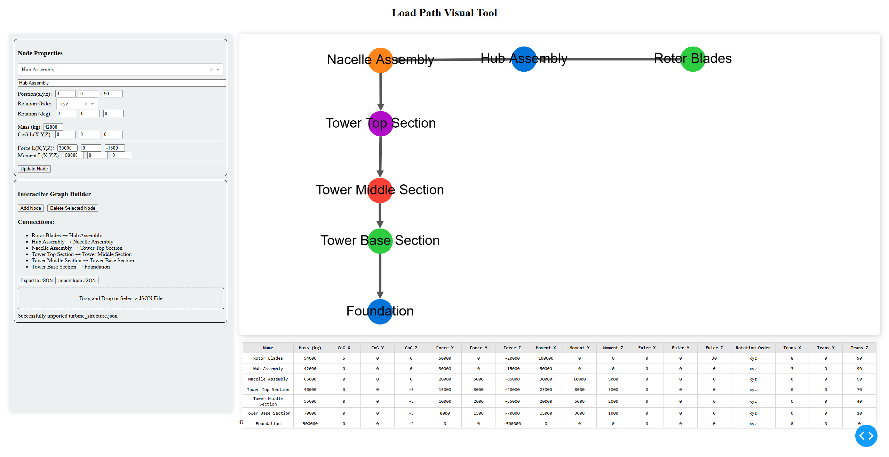

# Load Path Visual Tool

An interactive web-based tool for creating and visualizing load path graphs with node properties and connections. Built with Dash and Cytoscape.js.
## GUI Screenshot



The interface provides an intuitive layout with a sidebar for node properties and graph building controls, and a main visualization area for the interactive graph.

## Overview

Load Path Visual is a powerful tool designed for engineers and analysts to create, visualize, and analyze load path diagrams. It provides an intuitive interface for building node-based graphs with detailed mechanical properties such as mass, center of gravity, forces, and moments.

## Features

- **Interactive Graph Building**
  - Add and delete nodes with drag-and-drop functionality
  - Create connections between nodes with unique IDs
  - Visual node selection and connection management
  - Real-time graph updates
  - Automatic edge refreshing for improved visibility

- **Node Properties Management**
  - Mass configuration
  - Center of Gravity (CoG) coordinates (X,Y,Z)
  - Position/Translation coordinates
  - Rotation angles with customizable order (Euler angles)
  - Force vectors (X,Y,Z)
  - Moment vectors (X,Y,Z)

- **Data Management**
  - Export graph data to JSON with timestamps for unique filenames
  - Compact JSON formatting for improved readability
  - Import graph data from JSON files
  - Real-time property table view
  - Persistent node positioning

- **Visual Features**
  - Color-coded nodes
  - Directional arrows for connections
  - Node selection highlighting
  - Clean and modern UI design

## Installation

1. Clone the repository:
```bash
git clone https://github.com/yourusername/load-path-visual.git
cd load-path-visual
```

2. Create a virtual environment (recommended):
```bash
python -m venv venv
source venv/bin/activate  # On Windows: venv\Scripts\activate
```

3. Install required packages:
```bash
pip install -r requirements.txt
```

## Dependencies

- dash
- dash-cytoscape
- dash-html-components
- dash-core-components
- dash-table

## Usage

1. Start the application:
```bash
python load-visual.py
```

2. Open your web browser and navigate to:
```
http://localhost:8051
```

### Creating a Graph

1. **Adding Nodes**
   - Click the "Add Node" button to create a new node
   - Nodes will appear with random colors and positions
   - Each node has a unique ID that matches its name

2. **Creating Connections**
   - Click on a source node
   - Click on a target node to create a connection
   - Connections are displayed with directional arrows
   - Each connection has a unique ID for reliable tracking
   - If a connection exists but isn't visible, clicking the same nodes will refresh it

3. **Modifying Node Properties**
   - Select a node from the dropdown
   - Update properties in the side panel:
     - Mass
     - Center of Gravity
     - Position
     - Rotation
     - Forces
     - Moments
   - Click "Update Node" to save changes

4. **Managing Data**
   - Export: Click "Export to JSON" to save your graph with a timestamped filename
   - Import: Use "Import from JSON" to load a saved graph
   - View all node properties in the table below the graph

### JSON File Format

The application uses a specific JSON format for storing graph data:

```json
{
  "nodes": [
    {
      "data": {
        "id": "Node Name",
        "name": "Node Name",
        "color": "#2ECC40",
        "mass": 54000,
        "cog": [5, 0, 0],
        "external_force": [50000, 0, -20000],
        "moment": [100000, 0, 0],
        "euler_angles": [0, 0, 30],
        "rotation_order": "xyz",
        "translation": [8, 0, 90]
      },
      "position": {"x": 600, "y": 100}
    },
    // Additional nodes...
  ],
  "edges": [
    {
      "data": {
        "id": "e0",
        "source": "Source Node Name",
        "target": "Target Node Name"
      }
    },
    // Additional edges...
  ]
}
```

**Important Notes:**
- Node IDs must match their names for proper functioning
- Edge IDs should be unique (automatically handled by the application)
- Arrays are formatted on a single line for better readability
- When importing, ensure your JSON follows this structure

## Troubleshooting

If connections are not visible after loading a JSON file:
1. Try clicking on the same nodes again to refresh the connection
2. Check that both nodes still exist in the graph
3. Verify that your JSON file has the correct format with proper node IDs

## Contributing

Contributions are welcome! Please feel free to submit a Pull Request.

## License

This project is licensed under the MIT License - see the LICENSE file for details.

## Author

Pramod Kumar Yadav  
Email: pkyadav01234@gmail.com

## Acknowledgments

- Built with [Dash](https://dash.plotly.com/)
- Graph visualization powered by [Cytoscape.js](https://js.cytoscape.org/)
